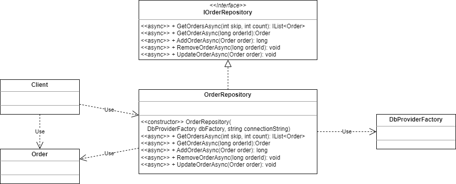
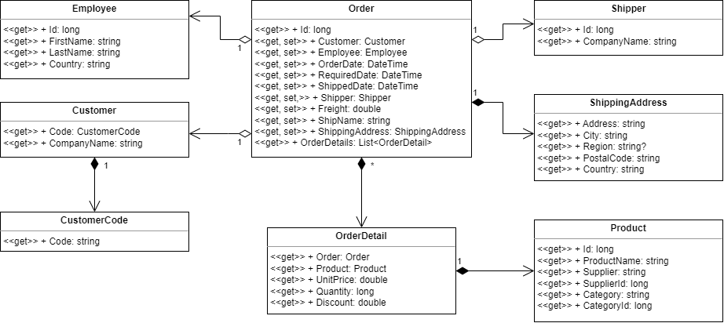
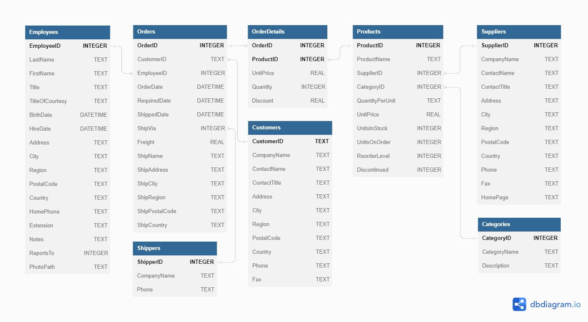

# Northwind Order Repository (ADO.NET)

An advanced-level task to practice the object repository that accesses a relational database as a data source.

To successfully complete the task, you must have the following skills:
* You should be familiar with structured and object-oriented programming in C#.
* You should be familiar with .NET's string parsing and data formatting capabilities.
* You should be familiar with the task asynchronous programming model (TAP).
* You should be familiar with [ADO.NET](https://learn.microsoft.com/en-us/dotnet/framework/data/adonet/ado-net-overview) basics.
* You should be familiar with [SQL](https://en.wikipedia.org/wiki/SQL) basics (DML commands).

Estimated time to complete the task: 6 hours.

The task requires [.NET 6 SDK](https://dotnet.microsoft.com/en-us/download/dotnet/6.0) to be installed.

## Task Description

In this task, you have to develop the [OrderRepository](Northwind.Services.Ado/Repositories/OrderRepository.cs) class, which is an implementation of the Repository design pattern. A repository object should access a data source using an ADO.NET provider.

Class diagram 1. OrderRepository class.

The `OrderRepository` class provides methods for searching and returning order data, as well as methods for managing orders.
* [GetOrdersAsync](Northwind.Services/Repositories/IOrderRepository.cs#L15) returns a list of orders from a repository. The `skip` method parameter specifies the number of orders to skip before adding an order to the result list. The `count` method parameter specifies the number of orders to return. The result list should be sorted by order ID, from smallest to largest.
* [GetOrderAsync](Northwind.Services/Repositories/IOrderRepository.cs#L22) returns an order with the specified identifier.
* [AddOrderAsync](Northwind.Services/Repositories/IOrderRepository.cs#L30) adds a new order to the repository as well as order details.
* [RemoveOrderAsync](Northwind.Services/Repositories/IOrderRepository.cs#L37) removes an order with the specified identifier as well as the order details.
* [UpdateOrderAsync](Northwind.Services/Repositories/IOrderRepository.cs#L44) updates order data as well as order details.

An order is represented by the [Order](Northwind.Services/Repositories/Order.cs) class. There are a few related classes that represent order data and order details.

Class diagram 2. Order class.

The `OrderRepository` class must use the [SQLite in-memory database](https://www.sqlite.org/inmemorydb.html) as a data source. The repository object is initialized with a database connection string that it should use to open a database connection.

The database schema

Database diagram 1. Northwind Database Schema.

### General Requirements

* The changes that are required to complete this task should be made in the [OrderRepository.cs](Northwind.Services.Ado/Repositories/OrderRepository.cs) file.
* You are allowed to add a new file to the [Repositories](Northwind.Services.Ado/Repositories) folder but not modify existing source, project, or test files.
* Do not install additional NuGet packages for the projects in this solution.
* The task is considered completed if all unit tests pass successfully.

### Implementation Requirements

The implementation of the `OrderRepository` class must meet the following requirements:

* The repository class must be public and sealed.
* The repository class must have the same name as the file name.
* The repository class must implement the [IOrderRepository](Northwind.Services/Repositories/IOrderRepository.cs) interface.
* Methods declared in the `IOrderRepository` interface must be implemented in the repository class as asynchronous methods that conform to the [task asynchronous programming model](https://learn.microsoft.com/en-us/dotnet/csharp/asynchronous-programming/task-asynchronous-programming-model).
* The repository class must use only abstract classes from the [System.Data.Common](https://learn.microsoft.com/en-us/dotnet/api/system.data.common) namespace so that the implementation of the `OrderRepository` class is provider-independent. Do not use provider-specific classes to implement the repository.
* The repository class must use the [DbProviderFactory](https://learn.microsoft.com/en-us/dotnet/framework/data/adonet/dbproviderfactories) object to create instances of a provider's implementation of the data source classes.
* The repository class must implement *Constructor Injection* form of the [Dependency Injection](https://en.wikipedia.org/wiki/Dependency_injection) design pattern.
* The repository class must have one public constructor with two parameters to initialize a repository object with the `DbProviderFactory` object and [database connection string](https://learn.microsoft.com/en-us/dotnet/framework/data/adonet/connection-strings) (see Class diagram 1).
* Use [parameterized commands](https://learn.microsoft.com/en-us/dotnet/framework/data/adonet/configuring-parameters-and-parameter-data-types) to pass values to SQL statements (this helps guard against "SQL injection" attacks).
* In methods that change the state of a database, use [local transactions](https://learn.microsoft.com/en-us/dotnet/framework/data/adonet/local-transactions) to ensure the integrity and consistency of the data in the database.
* Use [invariant culture](https://learn.microsoft.com/en-us/dotnet/api/system.globalization.cultureinfo.invariantculture) to parse strings and convert the value of objects to strings.
* Use the SQLite SQL dialect in database queries because the SQLite database is used as the data source. See the [SQLite documentation](https://www.sqlite.org/lang.html) for help.

## Task Checklist

- [ ] The solution builds without compilation errors.
- [ ] All unit tests pass successfully.
- [ ] There are no compilation warnings.
- [ ] All changes are in the [Repositories](Northwind.Services.Ado/Repositories) folder. There are no changes in project and test files.
- [ ] All changes in source files are committed and pushed to the remote repository.
